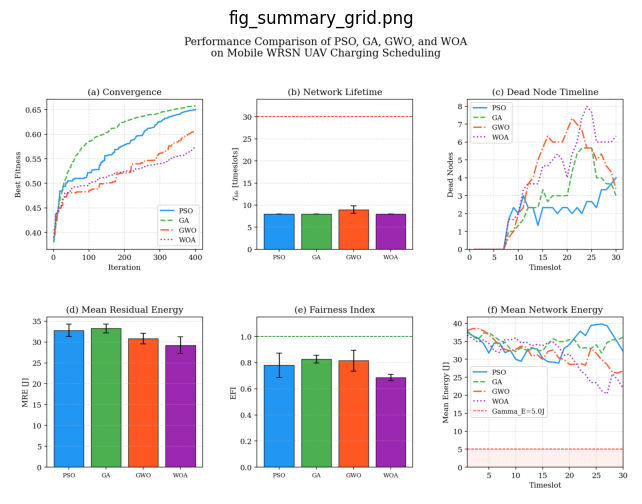
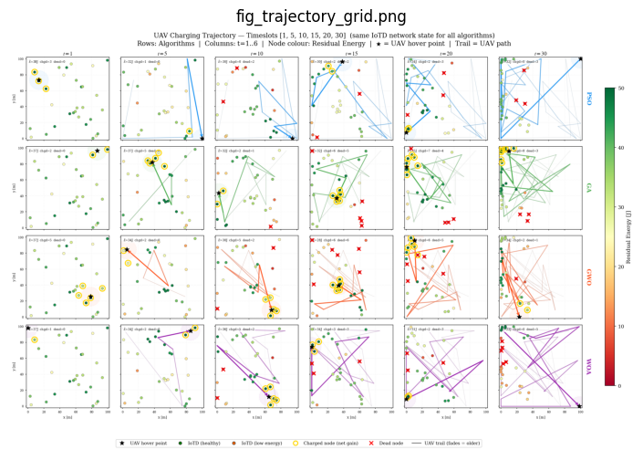
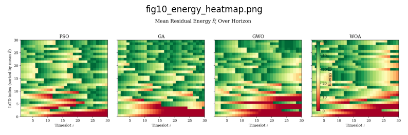

# UAV-Assisted Wireless Charging for Mobile Disaster IoT Networks: A Metaheuristic Optimization Approach

[](https://www.python.org/)
[](https://numpy.org/)
[](https://matplotlib.org/)
[](https://en.wikipedia.org/wiki/Particle_swarm_optimization)
[](https://en.wikipedia.org/wiki/Genetic_algorithm)
[](https://en.wikipedia.org/wiki/Metaheuristic)
[](https://en.wikipedia.org/wiki/Metaheuristic)
[](https://en.wikipedia.org/wiki/Internet_of_things)
[](https://en.wikipedia.org/wiki/Unmanned_aerial_vehicle)
[](LICENSE)

This repository presents a metaheuristic optimization framework for **UAV-assisted wireless charging in mobile disaster IoT networks**. The project studies how a single UAV can act as a mobile wireless charger for moving IoT devices in a disaster-response environment where ground infrastructure may be damaged and sensor nodes are energy constrained.

The framework compares four population-based optimization algorithms:

- **Particle Swarm Optimization (PSO)**
- **Genetic Algorithm (GA)**
- **Grey Wolf Optimizer (GWO)**
- **Whale Optimization Algorithm (WOA)**

The objective is to optimize the UAV charging trajectory and hover duration over time so that mobile IoT devices remain operational for as long as possible.

---

## Project Overview

In disaster-response scenarios, IoT devices may be attached to rescue workers, mobile assets, or temporary monitoring units. These devices collect and relay critical sensing data, but their limited battery capacity can cause network failure if they are not recharged in time.

This project models a **Wireless Rechargeable Mobile Network (WRMN)** where a UAV flies over a two-dimensional disaster area and wirelessly transfers energy to IoT devices. Since the devices move continuously, the UAV must adapt its charging path and decide:

- where to fly,
- which region to charge,
- how long to hover,
- and how to balance energy fairness across the network.

The project answers the following question:

> **Which metaheuristic algorithm provides the best UAV charging schedule for keeping a mobile disaster IoT network alive?**

---

## Research Scenario

The project simulates a disaster IoT network with mobile sensor nodes and a single UAV charger.

The scenario follows these steps:

1. **Deploy mobile IoT devices**
   - IoT devices are randomly distributed in a 100 × 100 m² area.
   - Each device has a limited rechargeable battery.
   - Devices continuously move according to the Gauss-Markov mobility model.

2. **Model device energy consumption**
   - Each IoT device consumes energy for sensing and communication.
   - Energy consumption depends on local network connectivity and communication distance.

3. **Deploy a UAV wireless charger**
   - The UAV flies at a fixed altitude.
   - At each timeslot, it chooses a charging location and hover duration.
   - The UAV wirelessly transfers energy to devices within charging range.

4. **Optimize UAV trajectory**
   - Each candidate solution encodes the UAV location and hover duration across the full time horizon.
   - Metaheuristic algorithms search for the trajectory that improves residual energy and network lifetime.

5. **Evaluate algorithm performance**
   - PSO, GA, GWO, and WOA are tested under identical network conditions.
   - Each algorithm is evaluated using multiple energy, fairness, and trajectory-based metrics.

---

## System Model

The network consists of:

- **30 mobile IoT devices**
- **1 UAV charger**
- **100 × 100 m² deployment area**
- **Fixed UAV altitude**
- **Wireless power transfer charging model**
- **Gauss-Markov node mobility**
- **Finite battery capacity for each IoT device**
- **Energy-death threshold below which a node is considered non-operational**

The UAV charging schedule is optimized over a finite horizon. At each timeslot, the UAV travels, hovers, charges nearby nodes, and then moves to the next selected location.

---

## Methodology

### 1. Mobile IoT Network Simulation

The mobile disaster IoT network is initialized with randomly deployed nodes. Node mobility is simulated using the Gauss-Markov model, which allows each node to move with temporal correlation in speed and direction.

This makes the simulation more realistic than a static sensor network because the UAV must respond to continuously changing node positions.

---

### 2. Energy Consumption Model

Each IoT device consumes energy over time. The energy model accounts for:

- electronics energy,
- packet transmission and reception,
- communication distance,
- local connectivity,
- and battery depletion.

Nodes that fall below the minimum energy threshold are treated as dead nodes.

---

### 3. UAV Wireless Charging Model

The UAV transfers energy to IoT devices using a distance-dependent wireless power transfer model. Devices closer to the UAV receive more effective charging, while distant devices may receive little or no useful energy.

The UAV also consumes energy while:

- flying,
- hovering,
- and transitioning between charging locations.

This creates a trade-off between moving to reach depleted nodes and staying longer to charge nearby nodes.

---

### 4. Optimization Problem

Each candidate solution represents a complete UAV charging plan:

```text
Solution = [
  UAV x-position at each timeslot,
  UAV y-position at each timeslot,
  UAV hover duration at each timeslot
]
```

The optimization goal is to maximize network health by improving mean normalized residual energy while penalizing nodes that fall below the energy threshold.

---

### 5. Metaheuristic Algorithms

Four algorithms are compared under the same network assumptions:

| Algorithm | Role in This Project |
|---|---|
| PSO | Searches using swarm movement and velocity updates |
| GA | Evolves UAV schedules through selection, crossover, and mutation |
| GWO | Uses hierarchical wolf-inspired leadership search |
| WOA | Uses whale-inspired encircling and spiral search behavior |

---

## Visual Results

### Performance Summary

The summary grid compares convergence, network lifetime, dead-node timeline, mean residual energy, fairness index, and mean network energy for PSO, GA, GWO, and WOA.



---

### UAV Charging Trajectory

The trajectory grid shows how each algorithm moves the UAV across the disaster area at selected timeslots. Node color indicates residual energy, red crosses indicate dead nodes, gold rings indicate nodes receiving net energy gain, and the UAV trail shows movement history.



---

### Residual Energy Heatmap

The heatmap shows how mean residual energy changes across IoT devices and timeslots for the different algorithms.



---

## Key Evaluation Metrics

The algorithms are compared using:

- **Network lifetime**
- **Mean residual energy (MRE)**
- **Energy fairness index (EFI)**
- **Total dead-node timeslots (TDNT)**
- **Best fitness**
- **UAV energy consumption**
- **Charging coverage rate**
- **Convergence iteration**
- **Trajectory behavior**

---

## Results Summary

The results show that different algorithms offer different advantages.

- **GA** provides strong overall network health, maintaining higher residual energy and better fairness across mobile IoT devices.
- **GWO** can reduce UAV energy consumption, making it useful when UAV energy efficiency is the main priority.
- **PSO** provides competitive convergence behavior but may struggle with mobility-induced changes in the search landscape.
- **WOA** shows more oscillatory behavior and can produce longer UAV transits that reduce hover time and increase node energy risk.

The trajectory plots show that broader spatial coverage is important because mobile nodes may drift toward the network boundary, where they become harder to recharge effectively.

---


## Model Concept

```text
Mobile IoT Network
      │
      ▼
Gauss-Markov Node Mobility
      │
      ▼
IoT Energy Consumption Update
      │
      ▼
Candidate UAV Charging Schedule
      │
      ▼
Wireless Power Transfer Simulation
      │
      ▼
Residual Energy and Dead Node Evaluation
      │
      ▼
Fitness Score
      │
      ▼
Metaheuristic Optimization
PSO | GA | GWO | WOA
      │
      ▼
Best UAV Trajectory and Charging Policy
```

---

## Scientific Significance

This project contributes to UAV-assisted disaster IoT networks by comparing metaheuristic algorithms under mobile network conditions. Instead of assuming static nodes, the framework evaluates the harder case where IoT devices move continuously and their energy states change over time.

The approach can support:

- disaster-response IoT planning,
- UAV wireless charging scheduling,
- mobile sensor network lifetime improvement,
- algorithm selection for energy-constrained UAV systems,
- future online replanning and multi-UAV coordination.

---

## Limitations

This project uses an offline optimization setting, meaning the UAV trajectory is planned over the full time horizon using simulated mobility information. In real disaster scenarios, node locations and energy states may need to be updated online.

The framework also uses a single UAV. Larger disaster areas may require multiple UAVs, coordination strategies, obstacle awareness, and real-time replanning.

---

## Future Work

Future improvements may include:

- online UAV trajectory replanning,
- multi-UAV charging coordination,
- obstacle-aware disaster-zone navigation,
- real-time node localization,
- reinforcement learning-based scheduling,
- hybrid metaheuristic-deep learning approaches,
- fairness-aware and priority-aware charging for critical nodes.

---

## Citation

If you use this work, please cite the IEEE paper:

```bibtex
@INPROCEEDINGS{abusirdaneh2025uavcharging,
  author={Abusirdaneh, Manar Anwer and Al Aghbari, Zaher and Elsayed, Saber},
  booktitle={International Conference on Integrated Intelligence and Cognitive Engineering (ICIICE)},
  title={UAV-Assisted Wireless Charging for Mobile Disaster IoT Networks: A Metaheuristic Optimization Approach},
  year={2025},
  volume={},
  number={},
  pages={},
  keywords={Wireless rechargeable sensor networks;UAV-assisted charging;Trajectory optimisation;Metaheuristic algorithms;Network lifetime;Gauss-Markov mobility;Disaster response;Mobile IoT networks},
  doi={}}

```

**IEEE format:**
M. A. Abusirdaneh, Z. Al Aghbari, and S. Elsayed, “UAV-Assisted Wireless Charging for Mobile Disaster IoT Networks: A Metaheuristic Optimization Approach,” International Conference on Integrated Intelligence and Cognitive Engineering (ICIICE), 2026.
---

## License

This project is licensed under the MIT License — see the [LICENSE](LICENSE) file for details.

---

## Contact

**Manar Anwar**
📧 mabusirdaneh@outlook.com
🔗 [GitHub @MAK1406](https://github.com/MAK1406)

---

<p align="center"><em>If you find this work useful, please ⭐ the repo — it helps others discover it.</em></p>
